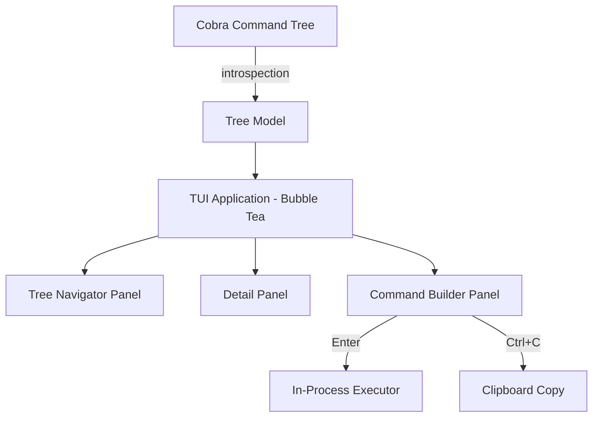

# cobra-explorer

[](https://pkg.go.dev/github.com/oakwood-commons/cobra-explorer/explore)
[](https://github.com/oakwood-commons/cobra-explorer/actions/workflows/test.yml)

An interactive TUI for any [Cobra](https://github.com/spf13/cobra)-based CLI application. Browse the full command tree, inspect flags and documentation, build commands visually, and execute them — all without memorizing help output.

<p align="center">
  
</p>

## Features

- **Command tree navigation** — Browse all commands and subcommands in an interactive tree
- **Flag discovery** — See all flags with types, defaults, and descriptions
- **Command builder** — Assemble commands visually with type-aware flag inputs (using each flag's shorthand form when available)
- **In-process execution** — Run built commands directly from the TUI
- **Clipboard copy** — Copy the assembled command string to your clipboard
- **Zero-config integration** — Add to any Cobra CLI with a single line of code

## Installation

```bash
go get github.com/oakwood-commons/cobra-explorer
```

Requires Go 1.25 or later.

## Quick Start

### Add as a subcommand (recommended)

```go
package main

import (
    "github.com/spf13/cobra"
    "github.com/oakwood-commons/cobra-explorer/explore"
)

func main() {
    rootCmd := buildYourCLI()
    rootCmd.AddCommand(explore.NewCommand(rootCmd))
    rootCmd.Execute()
}
```

Then run:

```bash
mycli explore
```

### Direct launch

```go
import "github.com/oakwood-commons/cobra-explorer/explore"

func main() {
    rootCmd := buildYourCLI()
    if err := explore.Run(rootCmd); err != nil {
        os.Exit(1)
    }
}
```

## Try the Demo

The repository ships with a runnable demo CLI under [`examples/basic`](examples/basic/main.go) that wires the explorer into a small Cobra command tree (with `run`, `config`, and `version` commands).

Run it directly:

```bash
# From the repository root
go run ./examples/basic explore
```

Or build a binary first:

```bash
# Build the demo into ./bin/demo
go build -o bin/demo ./examples/basic

# Launch the interactive explorer
./bin/demo explore

# Or inspect the plain Cobra CLI it exposes
./bin/demo --help
./bin/demo run server --port 8080
```

If you use [Task](https://taskfile.dev), the same demo is available as a one-liner:

```bash
task example   # runs: go run ./examples/basic/ explore
```

Inside the TUI, use the [key bindings](#key-bindings) below to browse the command tree, edit flags, and build or execute a command.

## Configuration

Use functional options to customize behavior:

```go
explore.NewCommand(rootCmd,
    explore.WithBinaryName("mycli"),       // override display name
    explore.WithShowHidden(true),          // show hidden commands
    explore.WithExecution(true),           // enable in-TUI execution
    explore.WithThemeName("dracula"),      // select a theme preset by name
    explore.WithLightTheme(),              // shorthand for WithThemeName("light")
)
```

### Available Options

| Option | Description | Default |
|--------|-------------|---------|
| `WithBinaryName(name)` | Override the binary name shown in the TUI | Root command name |
| `WithThemeName(name)` | Select a theme preset by name (unknown names fall back to the default) | `"dark"` |
| `WithLightTheme()` | Use the built-in light theme (shorthand for `WithThemeName("light")`) | — |
| `WithShowHidden(bool)` | Show hidden commands in the tree | `false` |
| `WithExecution(bool)` | Enable in-process command execution | `false` |

### Themes

The explorer ships with several theme presets, selectable by name via
`WithThemeName`:

| Name | Description |
|------|-------------|
| `dark` | Default dark theme |
| `night` | Darker dark theme with a near-black background |
| `light` | Light theme with a white background |
| `dracula` | Based on the Dracula color scheme |
| `nord` | Based on the Nord color scheme |
| `terminal` | Transparent theme that inherits your terminal's background (light text, for dark terminals) |
| `terminal-light` | Transparent theme for light terminals (dark text) |

See [doc/themes/README.md](doc/themes/README.md) for a screenshot of each theme.

#### Choosing a theme at runtime (`--theme`)

The `explore` command also exposes a `--theme` flag so end users can pick a
theme without any code changes:

```bash
mycli explore --theme dracula
```

Whatever theme the developer configures with `WithThemeName` (or
`WithLightTheme`) acts as the **default**. When a user passes `--theme`, their
choice **overrides** that default for the session; if they omit the flag, the
developer's configured theme is used. Passing an unknown theme name returns an
error listing the valid names, and shell completion suggests the available
presets.

To see the available themes, use the `--list-themes` flag:

```bash
mycli explore --list-themes
```

This prints the list of theme names and exits without launching the TUI.

Each theme is derived from a small `Palette` of semantic colors (background,
foreground, accent, borders, status colors, …), so every panel shares a
consistent surface and text color.

**Contributing a theme:** add a `Palette` to `internal/theme` and register it in
`internal/theme/registry.go` so it becomes selectable by name. Because a preset
is just a palette, adding one is a few lines — see the existing `DarkPalette`
and `LightPalette` for reference.

## Key Bindings

The UI has four focus zones (tree, description, flags, command bar). Press `Tab` /
`Shift+Tab` to move between the zones that are available for the selected command;
only the focused zone responds to arrow keys and `Enter`.

| Key | Context | Action |
|-----|---------|--------|
| `Tab` / `Shift+Tab` | Global | Cycle focus forward / backward between zones |
| `Ctrl+C` | Global | Quit without emitting a command |
| `q` | Global | Quit (ignored while editing a flag in the flags zone) |
| `↑`/`k`, `↓`/`j` | Tree | Move between commands |
| `→`/`l` | Tree | Expand and descend into subcommands |
| `←`/`h` | Tree | Collapse, or go to parent if already collapsed |
| `Enter` | Tree | Select a runnable command (or expand a group) |
| `Home` / `End` | Tree | Jump to first / last command |
| `↑`/`k`, `↓`/`j` | Description | Scroll the description text |
| `↑`/`k`, `↓`/`j` | Flags | Move between flags |
| `Space` | Flag (bool) | Toggle the flag |
| `Enter` | Flag | Toggle a bool, or start editing a value flag |
| `Enter` / `Tab` | Flag (editing) | Commit the value |
| `Esc` | Flag (editing) | Cancel and restore the previous value |
| `Enter` | Command Bar | Paste the command to the shell (or run it with `WithExecution`) |
| `c` | Command Bar | Copy the command string to the clipboard |
| `←`/`h`, `→`/`l` | Command Bar | Scroll a long command horizontally |
| `Home`/`0`, `End`/`$` | Command Bar | Jump to the start / end of the command |

## Architecture



The library introspects your Cobra command tree at startup (read-only, never mutates) and presents it through a [Bubble Tea](https://github.com/charmbracelet/bubbletea) TUI with multiple interactive panels.

## Development

This project uses [Task](https://taskfile.dev) as its task runner.

```bash
# Install task (macOS)
brew install go-task

# Run tests
task test

# Run linter
task lint

# Run the example
task example

# Run all CI checks locally
task ci

# List all available tasks
task
```

See [CONTRIBUTING.md](CONTRIBUTING.md) for development guidelines.

## License

Apache License 2.0 — see [LICENSE](LICENSE) for details.
