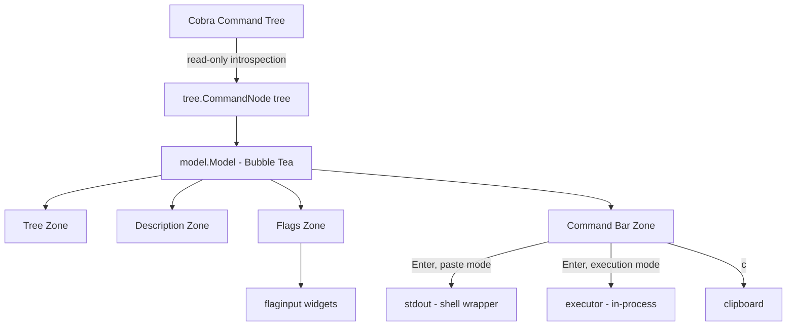

# cobra-explorer — Initial Design Document

> This is the **initial** design document for `cobra-explorer`, capturing the
> original architecture and intent. It is a historical snapshot and is **not**
> kept in sync with subsequent implementation changes — later behavior may
> diverge. For current behavior, consult the code and `README.md`.

## Overview

`cobra-explorer` is a standalone Go library that provides an interactive TUI for
any [Cobra](https://github.com/spf13/cobra)-based CLI application. It lets users
visually navigate the full command tree, inspect flags and documentation, build
commands interactively, and either **paste the built command to the shell** or
**execute it in-process** — all without memorizing help output.

- **Go module:** `github.com/oakwood-commons/cobra-explorer`
- **Public import path:** `github.com/oakwood-commons/cobra-explorer/explore`
- **Target audience:** CLI end users (guided discovery) and CLI developers
  (testing, demos, onboarding).

---

## Problem Statement

Cobra CLIs expose their capabilities through `--help` text. For CLIs with deep
command hierarchies and many flags, users must repeatedly run `<cli> --help`,
then `<cli> <cmd> --help`, recursively, and manually compose the final command
with the correct flags. This is slow, error-prone, and provides no way to
"browse" capabilities or experiment without reading documentation.

---

## Goals

- **Zero-config integration:** A single function call adds interactive
  exploration to any Cobra CLI.
- **Read-only introspection:** The library walks the Cobra command tree once at
  startup and never mutates command definitions.
- **Two exit modes:**
  - *Paste* (default): on Enter, exit the TUI and print the built command to
    stdout so a shell wrapper can place it in the readline buffer.
  - *In-process execution* (opt-in via `WithExecution`): run the built command
    via `cmd.Execute()` and show captured output in a scrollable result screen.
- **Clipboard copy:** Copy the assembled command string to the system clipboard
  with a hotkey.
- **Progressive disclosure:** Show commands first; reveal flags, docs, and the
  command preview contextually based on the focused zone.

## Non-Goals

- Replacing `--help` output or shell completions.
- Providing a GUI or web-based interface.
- Modifying Cobra command definitions at runtime.
- Handling commands that require raw terminal access (e.g., interactive REPLs).

---

## Public API

The entire public surface lives in the `explore` package and is intentionally
minimal. See [`explore/`](../explore).

### Add an `explore` subcommand (recommended)

```go
import "github.com/oakwood-commons/cobra-explorer/explore"

func main() {
    rootCmd := buildRootCommand()
    rootCmd.AddCommand(explore.NewCommand(rootCmd))
    rootCmd.Execute()
}
```

`explore.NewCommand(root, opts...)` returns a `*cobra.Command` with
`Use: "explore"` that launches the TUI when invoked.

### Direct launch

```go
if err := explore.Run(rootCmd, opts...); err != nil {
    os.Exit(1)
}
```

### Functional options

| Option | Effect | Default |
|--------|--------|---------|
| `WithBinaryName(name)` | Override the binary name shown in the TUI | Root command `Name()` |
| `WithTheme(theme)` | Set a custom theme | Dark theme |
| `WithLightTheme()` | Use the built-in light theme | — |
| `WithShowHidden(bool)` | Include hidden commands in the tree | `false` |
| `WithExecution(bool)` | Run the command in-process on Enter instead of pasting | `false` |

Options are collected into an unexported `config` struct in
[`explore/options.go`](../explore/options.go) and translated into
`model.Options` in [`explore/explore.go`](../explore/explore.go).

---

## Architecture

### Component diagram



### Package layout

All implementation lives under `internal/` so consumers cannot depend on it.

```
cobra-explorer/
  explore/              # PUBLIC API
    explore.go          #   Run(), NewCommand(), exitCommander
    options.go          #   Option, config, With* functions
    doc.go              #   package documentation
  internal/
    model/model.go      # Root Bubble Tea model: focus zones, Update, View
    tree/               # Command tree data structure + Cobra introspection
      builder.go        #   BuildTree(): cobra.Command -> CommandNode
      node.go           #   CommandNode, FlagInfo, AllFlags()
      model.go          #   Tree navigator sub-model (navigation, rendering)
      messages.go       #   CommandHighlightedMsg, CommandSelectedMsg
    flaginput/          # Type-aware flag input widgets
      flaginput.go      #   FlagInput interface + New() dispatcher + validators
      text.go toggle.go choice.go slice.go stepper.go
    builder/command.go  # BuiltCommand: flag state + string/args serialization
    executor/executor.go# In-process Cobra execution (opt-in)
    clipboard/          # OS-specific clipboard (build tags)
    theme/theme.go      # Theme struct + dark/light themes
    layout/layout.go    # Panel sizing / responsive layout math
    scrollbar/scrollbar.go # Custom scrollbar component
  examples/basic/       # Runnable demo CLI
```

Every TUI component follows the Elm architecture (`Init`/`Update`/`View`) and
communicates via typed messages rather than shared mutable state.

---

## Key Types

```go
// tree.CommandNode — internal, cobra-decoupled command model. Immutable after build.
type CommandNode struct {
    Name     string
    FullPath []string // e.g. ["mycli", "run", "solution"]

    Short, Long, Example, Deprecated string
    Aliases                          []string

    Hidden, Runnable bool
    GroupID          string

    Flags          []FlagInfo // local flags
    InheritedFlags []FlagInfo // persistent flags from ancestors

    RequiredTogether  [][]string // Cobra 1.8+ flag groups
    MutuallyExclusive [][]string

    Children []*CommandNode
    Parent   *CommandNode

    Annotations map[string]string
    Depth       int
    TotalLeaves int
}

// tree.FlagInfo — snapshot of a pflag.Flag.
type FlagInfo struct {
    Name, Shorthand, Usage, DefValue string
    Type                             string // pflag type name
    Required, Deprecated, Hidden     // (Deprecated is a string)
    Inherited                        bool
    NoOptDefVal                      string
    ValidValues                      []string // enum values from completion
}

// builder.BuiltCommand — the user's assembled command.
type BuiltCommand struct {
    Node       *tree.CommandNode
    FlagValues map[string]string
    Args       []string
}
```

`CommandNode.AllFlags()` returns flags in display order: **required first, then
other local flags, then inherited flags** (hidden flags excluded).

`BuiltCommand` provides:
- `SetFlag(name, value)` — empty value clears the flag.
- `ToArgs()` — argument slice for Cobra (bools become presence flags; slices are
  split on commas into repeated `--flag value` pairs).
- `String()` — copy-pasteable command string with shell quoting.
- `UnsetRequiredFlags()` / `IsValid()` — required-flag validation.

---

## Cobra Introspection

`tree.BuildTree(root, BuildOptions{...})` recursively converts the live Cobra
tree into a `CommandNode` tree. It is a one-time, read-only operation performed
in `model.New`. The `explore` command itself is excluded via
`ExcludeNames: []string{"explore"}` to avoid recursion.

- Local flags come from `cmd.LocalFlags()`, inherited from `cmd.InheritedFlags()`.
- Required flags are detected via the
  `cobra.BashCompOneRequiredFlag` annotation.
- Hidden commands/flags are skipped unless `WithShowHidden(true)` is set.

---

## TUI Layout & Focus Zones

The screen is divided into a header, a two-column body, a command bar, and a
footer. The right column stacks a description panel over a flags panel.

```
+--------------------------------------------------------------------+
| mycli explore                                            (header)   |
+----------------------+---------------------------------------------+
| Commands             |  <command path / flag name>       (desc)    |
|  v mycli             |  Short + Long + Usage + Examples +           |
|    v run             |  Subcommands ...                            |
|      server *        +---------------------------------------------+
|      worker *        |  Flags                                      |
|    config            |   > --port   int   (8080)  [8080]           |
|    version *         |     --host   str          [_____]           |
+----------------------+---------------------------------------------+
| > mycli run server --port 8080                        (command bar) |
+--------------------------------------------------------------------+
|  Tab: next zone  │  ↑/↓: navigate  ...                   (footer)  |
+--------------------------------------------------------------------+
```

Four focus zones are cycled with `Tab` / `Shift+Tab`. Only the focused zone
responds to arrow keys and Enter; the focused panel border is highlighted.

| Zone (`model` const) | Arrow keys | Enter |
|----------------------|------------|-------|
| `ZoneTree` | Navigate the command tree | Select runnable / expand group |
| `ZoneDesc` | Scroll description text | — |
| `ZoneFlags` | Move between flag rows | Toggle bool / edit value |
| `ZoneCommand` | — | Paste command, or run it (execution mode) |

### Adaptive Tab cycle

`recomputeZones()` rebuilds the active zone list every time the selected command
changes, skipping zones with no interactive content:

- **Tree** is always present.
- **Description** is included only when the text overflows its viewport.
- **Flags** is included only when the command has flags.
- **Command bar** is included only when the command is runnable.

When the description panel is *not* focused via the Flags zone, the description
zone shows command docs; while the Flags zone is focused, the top-right panel
shows details for the highlighted flag (type, default, required/inherited status,
valid values).

---

## Key Bindings

These match the handlers in [`internal/model/model.go`](../internal/model/model.go)
and [`internal/tree/model.go`](../internal/tree/model.go).

### Global

| Key | Action |
|-----|--------|
| `Tab` | Focus next zone |
| `Shift+Tab` | Focus previous zone |
| `Ctrl+C` | Quit without emitting a command |
| `q` | Quit (ignored while the Flags zone is focused, so `q` can't be typed by accident during navigation) |

### Tree zone

| Key | Action |
|-----|--------|
| `↑` / `k` | Move to previous visible node |
| `↓` / `j` | Move to next visible node |
| `→` / `l` | Expand node and descend to first child |
| `←` / `h` | Collapse node, or move to parent if already collapsed |
| `Enter` | Select command if runnable; otherwise expand/descend |
| `Home` | Jump to first node |
| `End` | Jump to last node |

### Description zone

| Key | Action |
|-----|--------|
| `↑` / `k` | Scroll up one line |
| `↓` / `j` | Scroll down one line |
| `u` | Half page up |
| `d` | Half page down |

### Flags zone

| Key | Action |
|-----|--------|
| `↑` / `k` | Move to previous flag |
| `↓` / `j` | Move to next flag |
| `Enter` | Toggle a bool flag, or begin editing a value flag |
| `Space` | Toggle a bool flag |

While editing a value flag:

| Key | Action |
|-----|--------|
| `Enter` / `Tab` | Commit the value |
| `Esc` | Cancel and restore the previous value |
| (typing) | Edit the value (type-validated) |

### Command bar zone

| Key | Action |
|-----|--------|
| `Enter` | If required flags are satisfied: **paste** the command to the shell (default) or **run** it in-process (when `WithExecution(true)`) |
| `c` | Copy the command string to the clipboard |

### Execution result screen (execution mode only)

| Key | Action |
|-----|--------|
| `↑` / `k`, `↓` / `j` | Scroll one line |
| `u` / `d` | Half page up / down |
| `g` / `G` | Jump to top / bottom |
| `q` / `Esc` / `Enter` | Dismiss and return to the TUI |

---

## Flag Input Handling

`flaginput.New(FlagInfo)` dispatches to a widget implementing the `FlagInput`
interface based on the pflag type:

| Flag type | Widget | Notes |
|-----------|--------|-------|
| `bool` | `Toggle` | Space/Enter flips; presence flag in output |
| `int*`, `uint*` | `TextInput` + `ValidateInt` | Rejects non-integer input |
| `float32/64` | `TextInput` + `ValidateFloat` | Rejects non-numeric input |
| `duration` | `TextInput` + `ValidateDuration` | Must parse as `time.Duration` |
| `count` | `Stepper` | Increment/decrement |
| `stringSlice`, `stringArray` | `SliceInput` | Comma-separated; expands to repeated flags |
| flag with `ValidValues` | `Choice` | Select from enum values |
| everything else | `TextInput` (no validator) | Free-form string |

Required flags are surfaced first in the flag list and the command bar shows a
`[missing: …]` warning until they are set; Enter in the command bar is gated on
`BuiltCommand.IsValid()`.

---

## Command Building & Serialization

As flag values change, `BuiltCommand` is updated and the command bar re-renders
live. `ToArgs()` produces Cobra-ready arguments:

- Command path segments after the binary name are prepended.
- Bool flags emit `--flag` only when `true`.
- Slice flags split on commas into repeated `--flag value` pairs.
- All other set flags emit `--flag value`.
- Positional `Args` are appended last.

`String()` prepends the binary name and applies shell quoting to any segment
containing whitespace or quote characters.

---

## Execution Model

### Paste mode (default)

On Enter in the command bar, the model emits `ExitCommandMsg{Command}`, which
triggers `tea.Quit`. `explore.Run` then prints the command to stdout. A shell
wrapper can capture stdout and place the command in the readline buffer:

```bash
# zsh — add to .zshrc
explore() {
    local cmd
    cmd=$("$@" explore) && [[ -n "$cmd" ]] && print -z "$cmd"
}
# usage: explore mycli
```

Bubble Tea renders to stderr, so stdout carries only the final command string.

### In-process execution mode (`WithExecution(true)`)

On Enter, `executor.NewInlineExecCommand(root, args)` runs as a `tea.Cmd`:

1. `resetFlagState(root)` recursively restores every flag to its default and
   clears `Changed`, preventing stale values from a prior run.
2. `root.SetArgs(args)`, with stdout/stderr redirected to buffers.
3. `root.Execute()` runs the command.
4. Combined output + any error is returned in `ExecutionDoneMsg` and shown in a
   full-screen scrollable result view.

> Note: execution reuses the caller's command tree, so commands that spawn
> long-running servers or require raw stdin are out of scope (see Non-Goals).

---

## Dependencies

| Dependency | Purpose |
|------------|---------|
| `github.com/spf13/cobra` | Peer dependency — the CLI framework being explored |
| `github.com/spf13/pflag` | Flag introspection (transitive via Cobra) |
| `github.com/charmbracelet/bubbletea` | TUI framework (Elm architecture) |
| `github.com/charmbracelet/bubbles` | Reusable components (viewport, textinput) |
| `github.com/charmbracelet/lipgloss` | Terminal styling / layout |

The dependency footprint is intentionally minimal and limited to the
charmbracelet ecosystem plus Cobra/pflag. Clipboard support is implemented
in-tree with OS-specific build tags rather than an external dependency.

---

## Future Considerations

- **Fuzzy search** across commands and flags (`/` to filter the tree).
- **Command history / favorites** within a session.
- **Argument completion** via Cobra's `ValidArgsFunction`.
- **Flag-group awareness** using the already-captured `RequiredTogether` /
  `MutuallyExclusive` metadata (Cobra 1.8+).
- **Mouse support** for clickable tree nodes and flag toggles.
- **Theming API** so CLI developers can match their brand.
