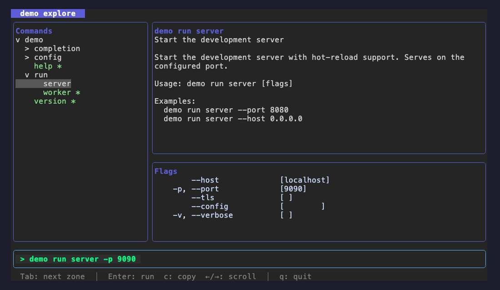
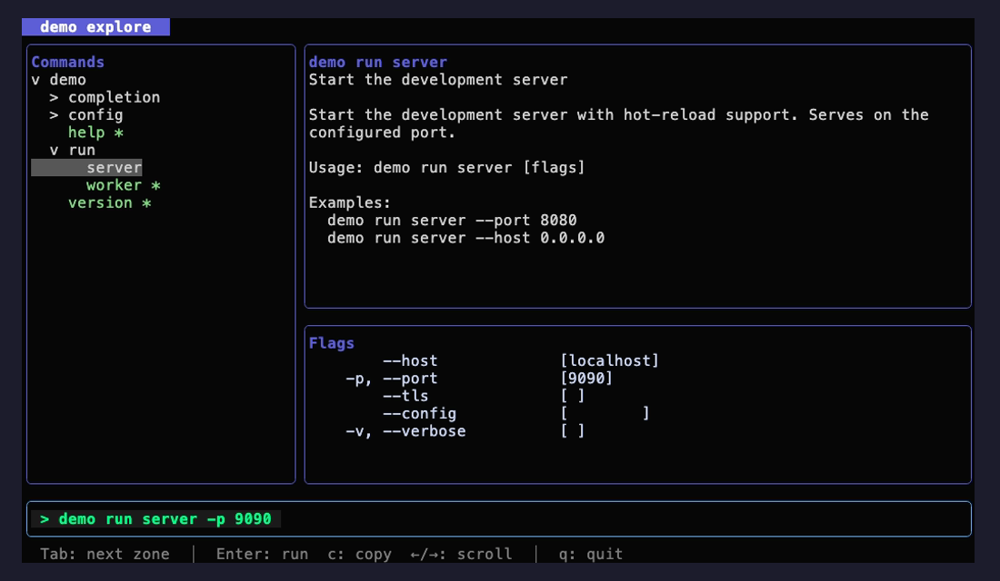
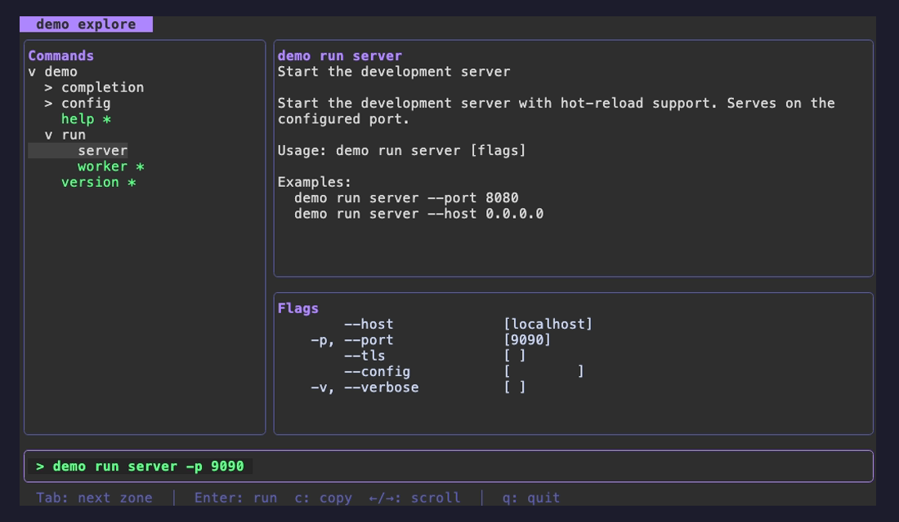
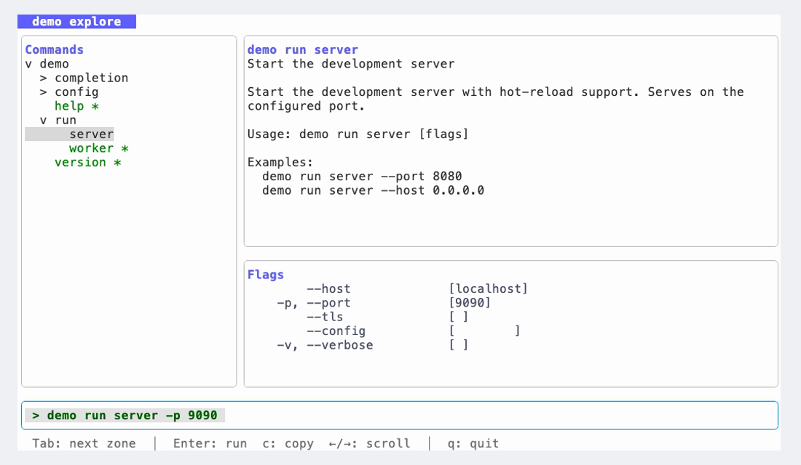
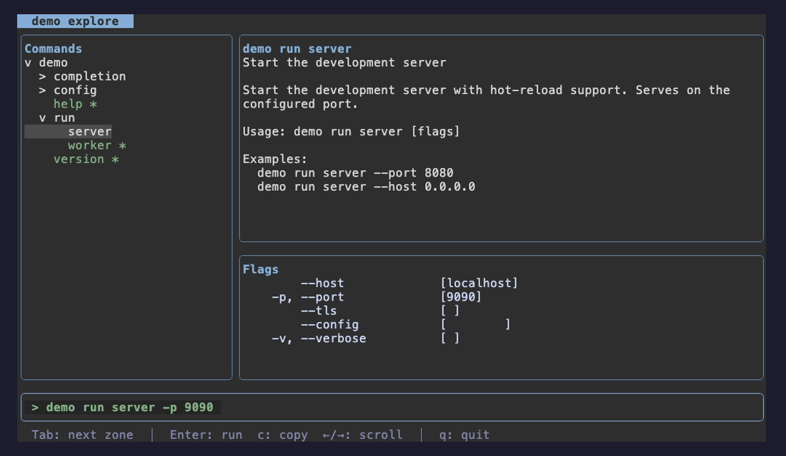
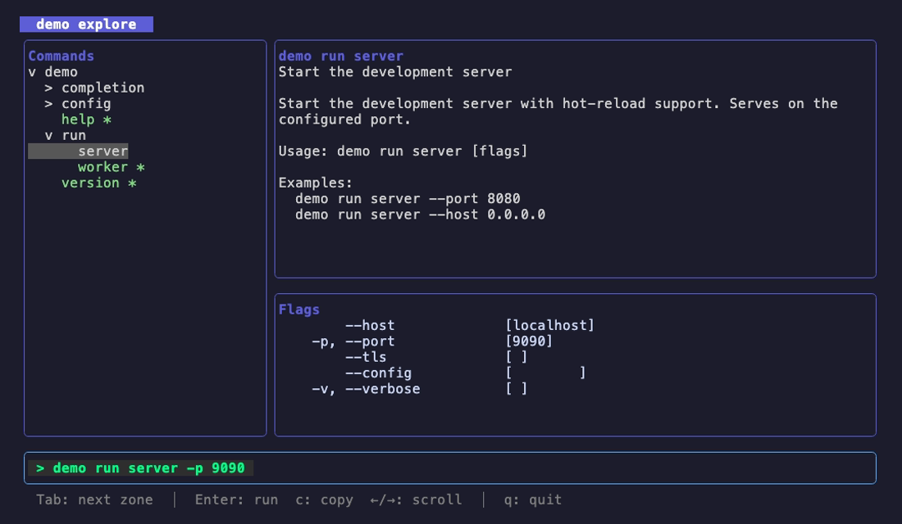
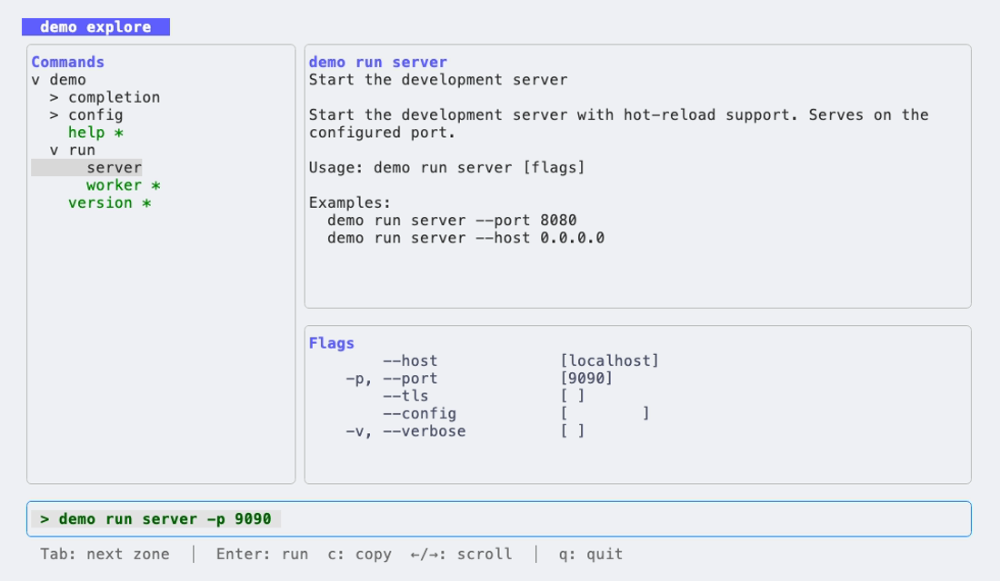

# Themes

cobra-explorer ships with several built-in theme presets. Select one with the
`WithThemeName` option:

```go
explore.NewCommand(root, explore.WithThemeName("dracula"))
```

The `WithThemeName` option sets the default theme. End users can override it at
runtime with the `--theme` flag (for example `mycli explore --theme nord`), or
run `mycli explore --list-themes` to print the list of available themes.

The available preset names are returned by `theme.Names()`. Contributors can add
their own presets with `theme.Register` (see `internal/theme/registry.go`).

## Available themes

### dark

The default theme — a dark surface with cool blue accents.



### night

A darker variant of the dark theme with a near-black background, ideal for
low-light environments and OLED displays.



### dracula

The popular [Dracula](https://draculatheme.com/) palette: a deep purple-gray
background with vivid pink and green accents.



### light

A bright white surface for light terminals, with high-contrast borders and
blue focus highlights.



### nord

The [Nord](https://www.nordtheme.com/) palette: a muted arctic blue-gray
background with soft frost accents.



### terminal

A transparent theme that inherits your terminal's own background instead of
painting one. Tuned with light text for dark terminals. The tree cursor and
command bar keep their fills so they stay legible. The screenshot below is
captured against a dark background to show how it blends in — on your machine
it takes on whatever background (and opacity) your terminal uses.



### terminal-light

The light-terminal counterpart of `terminal`: also transparent, but tuned with
dark text and borders so it reads clearly on terminals with a light background.
The screenshot is captured against a light background.



## Regenerating the screenshots

The screenshots are produced with [VHS](https://github.com/charmbracelet/vhs).
Each theme has its own tape in [tapes/](tapes/), and every tape launches the
demo CLI (`examples/basic`) with the `--theme` flag to capture that theme.

Re-render every screenshot with the helper script:

```sh
doc/themes/render-themes.sh
```

The script renders each theme in its own isolated VHS process and retries any
capture that comes out blank (VHS's alt-screen renderer occasionally drops a
frame). To re-render only specific themes, pass their names:

```sh
doc/themes/render-themes.sh dark nord
```

To render a single theme directly, run its tape:

```sh
vhs doc/themes/tapes/dracula.tape
```

The transparent `terminal` and `terminal-light` themes have no background of
their own, so their tapes capture them against representative dark and light
backgrounds so their contrast reads correctly.

